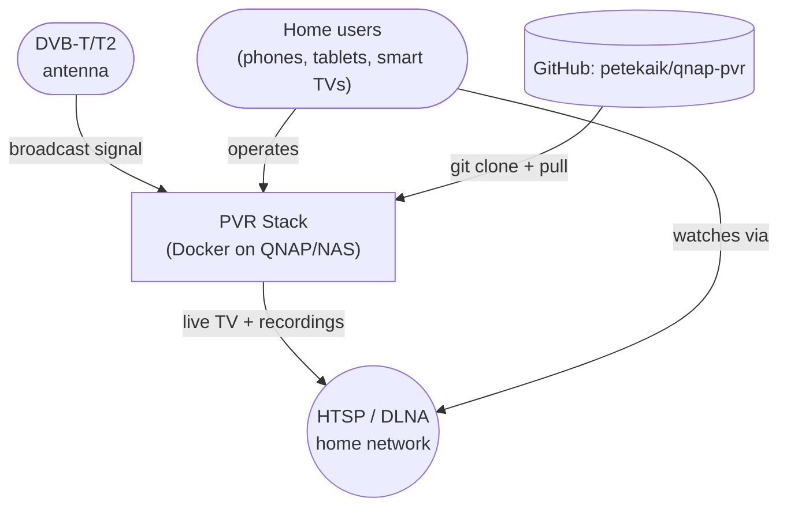
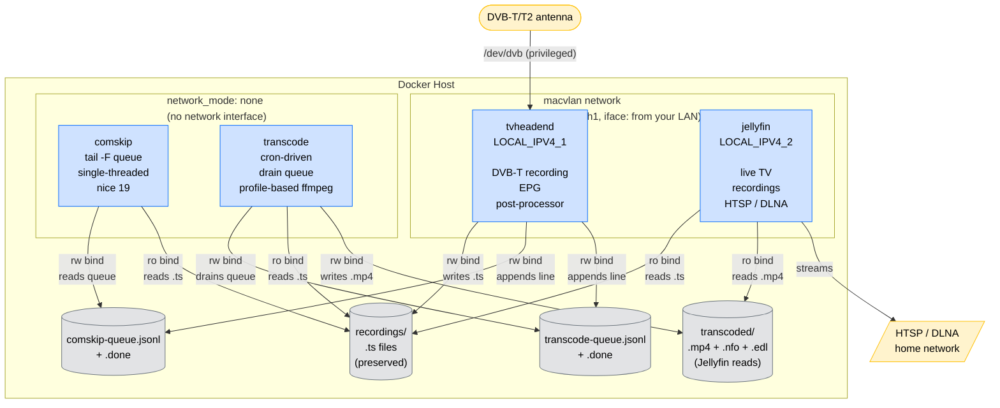
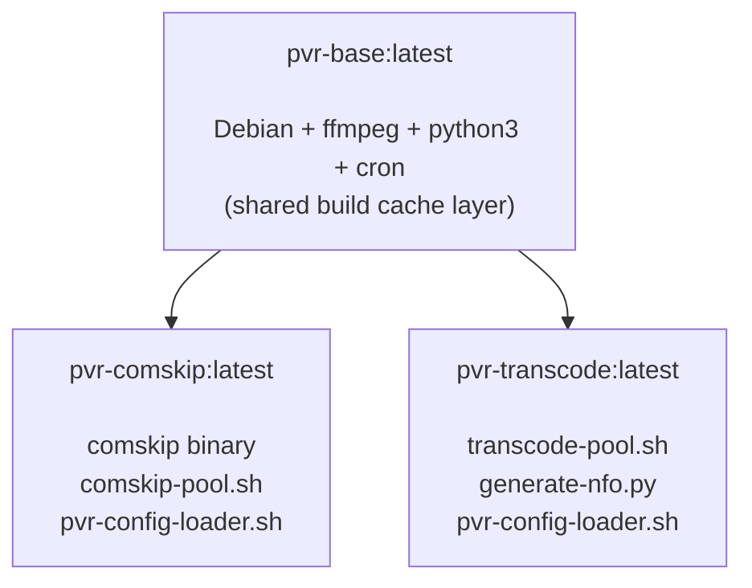
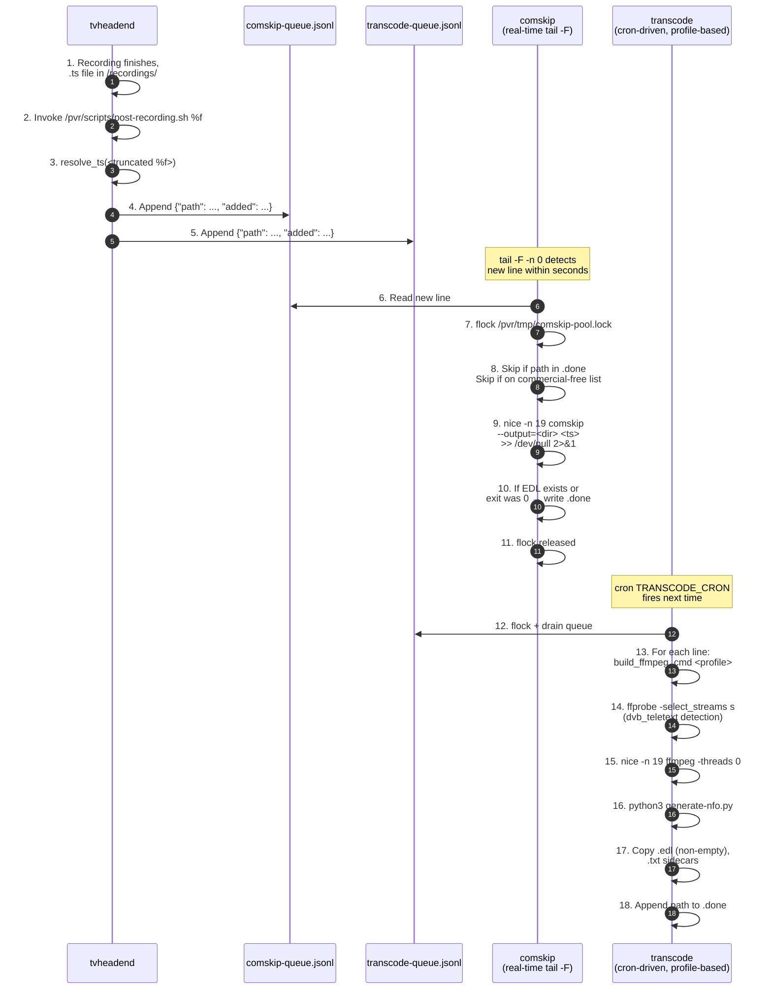

# Architecture

This document describes the PVR stack using the [C4 model](https://c4model.com/).
The system runs on a low-power Docker host where CPU-intensive work
must be split into independent units. The example shapes in this
document are deliberately abstract — substitute your own subnet,
host CPU and macvlan interface name when deploying.

## Context (C4 Level 1)

A household records free-to-air DVB-T/T2 broadcasts and watches them
on local network clients.



The PVR stack itself is the focus of this document. The C4 Level 2
detail below expands the green box into the four containers and the
queue files they share.

## Containers (C4 Level 2)



TVHeadend and Jellyfin attach to `eth1` (the macvlan) to get fixed
LAN IPs visible to clients; comskip and transcode run with
`network_mode: none` — no network interface at all. They
collaborate purely through the queue files on host volumes, never
through TCP. See [the Networks section](#networks) for the
rationale.

## Build-time layering

The two specialised worker images (`pvr-comskip`, `pvr-transcode`)
share a base layer so packages only install once.



`pvr-base` is not a service. It exists only as a Docker layer cache,
controlled by `./build.sh`. Without it, every `pvr-comskip` rebuild
would re-install Debian packages. The two specialised images are
`FROM pvr-base`, so the rebuilt layer ships once and both images
share it.

## Recording and post-processing flow



The diagram is intentionally fine-grained. The numbering on the
left edge maps to the steps in the prose below the diagram.

### Comskip pipeline (real-time)

```
comskip-pool.sh starts on container boot.
│
├── acquires flock on /pvr/tmp/comskip-pool.lock
│
├── tail -F -n 0 /comskip/queue/comskip-queue.jsonl
│   (waits for new lines forever)
│
└── for each new line:
    │
    ├── path="/recordings/Show/Show.ts"
    │   ├─ already in .done?  ─▶ SKIP already done
    │   ├─ file missing?      ─▶ SKIP missing source
    │   └─ channel "Yle TV1"? ─▶ SKIP commercial-free channel
    │
    ├── output: RUN comskip <path>
    │   nice -n 19 /usr/local/bin/comskip
    │           --ini=/etc/comskip/comskip.ini
    │           --output=<dir>
    │           <path>
    │           >> "$PROGRESS_LOG" 2>&1   (default /dev/null)
    │
    └── exit code:
        ├─ 0  ─ OK comskip, write path to .done
        │        (EDL was generated if commercials found)
        ├─ 1  ─ "Commercials were not found" — same as 0
        └─ >1 ─ FAIL comskip, write path to .done anyway
              (so a corrupt source does not block the queue)
```

The pool only processes new queue lines — once an EDL exists for a
recording, future TVH restart that re-adds the same line does not
re-run Comskip on it. This is the idempotency guarantee.

### Transcode pipeline (cron-driven)

```
At TRANSCODE_CRON, transcode-pool.sh runs.
│
├── acquires flock on /pvr/tmp/transcode-pool.lock
│
├── drain <queue> into <queue>.tmp, truncate <queue>
│   (atomic drain so a concurrent run never double-processes)
│
├── for each line in <queue>.tmp:
│   │
│   ├── path already in .done?  ─▶ SKIP already done
│   ├── path missing?           ─▶ SKIP missing source
│   │
│   ├── resolve_profile <name>
│   │   (loads fields from config.yaml under
│   │    profiles.<name>.*)
│   │
│   ├── ffprobe -select_streams s …  (if subtitle_strategy is not drop)
│   │   └─ dvb_teletext/dvb_subtitle only?  ─▶ -sn, log WARN
│   │
│   ├── build_ffmpeg_cmd <profile> <src> <dst>
│   │   (newline-separated argv + awk-quote + eval
│   │    so spaces/colons in $SCALE survive)
│   │
│   ├── nice -n 19 ffmpeg "$@"  > ffmpeg-$$.log 2>&1
│   │   │
│   │   └─ exit code:
│   │       ├─ 0 + non-empty output ─▶ OK
│   │       │   ├─ printf '%s\n' "$path" >> "$DONE"   (under flock)
│   │       │   ├─ python3 generate-nfo.py "$path" "$mp4"
│   │       │   │   (writes tvshow.nfo, episodedetails.nfo,
│   │       │   │    renames to Show SxxExx - Title.mp4)
│   │       │   ├─ copy .edl if non-empty            (else skip)
│   │       │   ├─ copy .txt if non-empty
│   │       │   └─ truncate ffmpeg-$$.log
│   │       │
│   │       └─ anything else         ─▶ FAIL, re-queue,
│   │                                    tail ffmpeg.log to transcode-nightly.log
│   │
│   └── (loop)
│
└── rm <queue>.tmp, transcode-pool finished
```

`resolve_profile` emits the values as shell variables — `video_codec`,
`audio_codec`, etc. — that `build_ffmpeg_cmd` reads. The library
maps `profiles.preservation.video.codec` → `video_codec`. See
[`CONFIGURATION.md`](./CONFIGURATION.md) for the YAML keys.

### Recording-completion hook

The TVH `postproc` field in a DVR profile triggers
`/pvr/scripts/post-recording.sh %f` when a recording finishes.
`%f` is the recording's filesystem path. TVH truncates `%f` at the
first space, so the hook includes a `resolve_ts` function that takes
the truncated prefix and looks for an exact `.ts` filename in the
parent directory; if not found, it falls back to glob. The resolved
path is then pushed to both queues.

## Networks

### `eth1` (external macvlan)

Fixed LAN IPs for TVHeadend and Jellyfin. Allows clients to find
them without DNS or container IP discovery. The values are read
from `.env` at deploy time:

  - `LOCAL_IPV4_1` — TVHeadend container
  - `LOCAL_IPV4_2` — Jellyfin container

The network name `eth1` and the parent interface (`-o parent=`) must
match the values you used when creating the macvlan below. The parent
is usually your LAN's physical interface (e.g. `eth0`, `br0`,
`eno1` — pick whatever your OS reports).

Create the network once on the host before the first
`docker compose up -d`. Replace the subnet, gateway and parent
interface placeholders with your LAN's values:

```bash
docker network create -d macvlan \
    --subnet=<your-macvlan-subnet> \
    --gateway=<your-lan-gateway> \
    -o parent=<your-lan-iface> \
    eth1
```

`compose.yml` references it as `external: true`.

### Comskip and transcode: `network_mode: none`

These two containers have no network interface at all at runtime.
`compose.yml` declares `network_mode: none` on each. The choice is
deliberate:

- **They do not need a network.** Communication between TVH and the
  workers is exclusively through shared filesystem queues
  (`${DATA}/comskip/queue/` and `${DATA}/transcoder/queue/`).
  Neither side ever opens a socket. comskip's binary does not
  phone home, FFmpeg only reads/writes local files, and the
  pool/entrypoint scripts have no `curl`, `wget`, `nslookup` or
  other network calls.
- **It removes attack surface.** A compromised comskip or
  transcode binary — or a vulnerability in FFmpeg's demuxer —
  cannot reach the LAN, the Jellyfin admin API, the QNAP
  management UI, or any other container. The kernel still
  applies the container's filesystem permissions, so shared
  queue files are still accessible, but anything off-host is
  unreachable.
- **It removes a whole class of "phantom" network configuration.**
  Earlier versions of this stack used an `internal: true` bridge
  (`pvr_internal`) for the same purpose, but Compose still
  attaches every container to a default `bridge` network unless
  you opt out, and `internal: true` only blocks the *default
  gateway* — not the implicit bridge. `network_mode: none` is
  the most explicit way to say "this container does not network".

Build-time networking is unaffected: `docker build` uses its own
build network to fetch apt packages and is independent of the
runtime network mode.

## Volumes on the host

The container bind mounts are the bridge between the network
partition and the persistent storage:

| Source on host                       | Mounted at (in container) | Used by                                          |
|--------------------------------------|----------------------------|--------------------------------------------------|
| `${DATA}/media/recordings/`          | `/recordings`              | comskip (ro), transcode (ro), tvheadend (rw)      |
| `${DATA}/media/transcoded/`          | `/media/transcoded`        | transcode (rw output), jellyfin (ro)             |
| `${DATA}/comskip/etc/`                | `/etc/comskip`             | comskip (ro — overrides baked config)             |
| `${DATA}/comskip/queue/`             | `/comskip/queue`           | comskip (rw — JSONL queue and log)               |
| `${DATA}/transcoder/scripts/`         | `/etc/transcoder`          | transcode (ro — pool + NFO scripts)              |
| `${DATA}/transcoder/queue/`          | `/transcoder/queue`        | transcode (rw — JSONL queue and log)              |
| `${DATA}/scripts/`                   | `/pvr/scripts`             | tvheadend (ro — post-recording hook)             |
| `${DATA}/scripts/config-loader.sh`   | `/usr/local/bin/config-loader.sh` | tvheadend (ro — sourced from post-recording) |
| `${DATA}/scripts/tvh-healthcheck.sh` | `/usr/local/bin/tvh-healthcheck.sh` | tvheadend (ro — used by healthcheck)        |
| `${DATA}/tmp/`                        | `/pvr/tmp`                 | all PVR containers (rw — locks, scratch logs)     |
| `${DATA}/tvheadend/config/dvr/log/`  | `/config/dvr/log`          | comskip + transcode (ro — read for NFO generation) |
| `/dev/dvb`                           | `/dev/dvb`                 | tvheadend (direct device access, privileged)      |

The `${DATA}/tmp/` shared scratch is an opt-in mount. Some NAS-class
hosts (QNAP, Synology, Asustor, …) ship with a small tmpfs at
`/tmp` — typically 32–128 MB. A single FFmpeg run can write 30+ MB
to stderr; on those hosts the next cron run can fail when `/tmp` is
full. By moving locks and FFmpeg stderr dumps to `${DATA}/tmp` (the
big volume), the constraint goes away. On hosts where `/tmp` is a
real filesystem (e.g. a Linux server with `tmpfs /tmp tmpfs
size=4G`), the mount is not necessary and can be dropped.

## Profile selection

The transcode container reads `default_profile` from
`config.yaml`. To override per recording, the post-recording hook
adds a `"profile": "<name>"` field to the queue line. For example:

```json
{"path":"/recordings/Show/Show.ts","added":"...","profile":"web_720p"}
```

Valid values are the profile names declared under `profiles:` in
`transcoder/scripts/config.yaml`. See
[`PROFILES.md`](./PROFILES.md) for the full reference.

## Why a separate comskip container?

Comskip runs whenever a new `.ts` appears in the queue. Putting it
inside the recorder's container would couple its CPU profile to
TVH's I/O path and risk dropping frames during recording. A
sidecar container lets the host schedule comskip at its own pace,
real-time, `nice 19`, and keeps the detection phase completely
independent of recording.

Comskip is single-threaded by design — adding workers does not
make it faster because the binary does not parallelise, and two
concurrent runs on the same `.ts` only thrash disk I/O.

## Why a separate transcode container?

Transcode is decoupled from recording. Even when running in real time
on a more powerful host, a low-power x86_64 CPU struggles when FFmpeg
and TVH's DVB demuxer compete for the same disk. Running transcode in
a sidecar container lets the host scheduler (`TRANSCODE_CRON`)
defer encoding to off-peak hours, and lets the resource limit cap
apply to encoding only (`memory: 2G`, `cpus: '3.0'` in
`compose.yml`) — not to TVH.

## Metadata for Jellyfin

Jellyfin's filename-based metadata lookup mistakes recordings for
movies (for example "Frendit" matched a movie called "Ihmeelliset
frendit"). The transcode container fixes this by:

- reading TVHeadend's DVR log directory (`/config/dvr/log`) read-only,
- parsing the original broadcast title and subtitle from the JSON
  log entry,
- extracting Finnish season/episode markers (`Kausi 4, 4/12`,
  `Kausi 31. Jakso 7-22`),
- identifying movies via TVH's native `content_type` field
  (1=movie, 4=sports, 0/8/10=series) rather than title heuristics,
- writing a minimal `tvshow.nfo` containing only the series title so
  Jellyfin looks up the rest online,
- writing a full `episodedetails.nfo` next to the `.mp4` with
  episode-specific plot, season, episode and air date,
- renaming the episode to `Show SxxExx - Title.mp4` so Jellyfin's
  built-in metadata lookup identifies it as a TV series episode.

For movies, `content_type=1` triggers a `movie.nfo` (not `tvshow.nfo`)
and the `Elokuva_` prefix is stripped from the filename.

## Related projects

- **DVB tuner drivers for QNAP:** https://github.com/petekaik/qnap-dvb

## Security considerations

- `.env` is excluded from Git via `.gitignore`. Only `.env.example`
  (placeholder values) ships in the repo.
- `compose.yml` references every secret via `${VAR}` substitution,
  so the file itself is safe to commit.
- No container ports are exposed to the host except via the macvlan
  network. Comskip and transcode have no published ports.
- The transcoder and post-recording scripts are mounted read-only
  where possible, so a security bug in a script cannot overwrite
  its own source.
- TVHeadend runs `privileged: true` solely to access `/dev/dvb`.
  The permission is scoped to that single service. The other
  services run unprivileged.
- `tvh-healthcheck.sh` only probes `/dev/dvb` and never reads
  TVH's runtime config (which contains the admin password hash).

## Scaling / future extensions

- **Multiple transcode containers** — the queue file would need a
  lock-aware split. The simplest way today is to scope each
  container to a subset of the recordings by running different
  `TRANSCODE_CRON` expressions on each host.
- **`ccextractor` for DVB subs** — install it into the transcode
  image (`apt-get install ccextractor`) and add a hook in
  `transcode-pool.sh` to run it on the source `.ts` when the
  source has only bitmap subtitles. The hook can drop a `.srt`
  next to the recording and the pool can copy it alongside the
  `.mp4`.
- **Hardware acceleration** — add a `qsv` profile with
  `video.codec: h264_qsv` and `extra: "-look_ahead 0 -async_depth 4"`.
  Requires `/dev/dri` mounted into the transcode container and an
  Intel CPU with QuickSync on the host.
- **WebGrab+Plus integration** — see `examples/webgrabplus/`. The
  example installs the `.NET 9` runtime and writes XMLTV output to
  a host directory that TVH reads as an additional EPG source.
